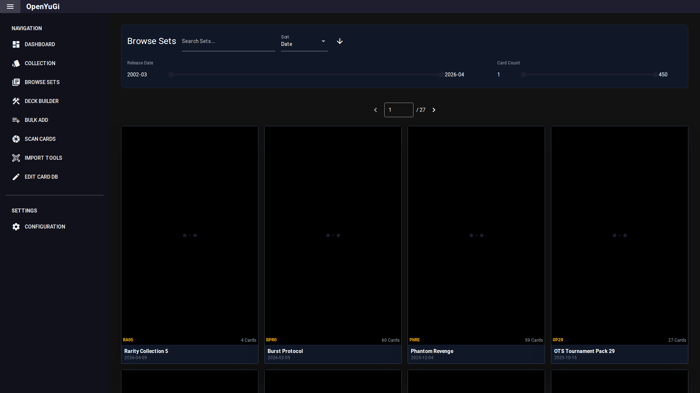

# Browse Sets

This tab is a visual gallery of all Yu-Gi-Oh! card sets.

## 1. Gallery View
- **Search**: Find sets by name or code (e.g., "Legend of Blue Eyes", "LOB").
- **Sorting**: Sort sets by Release Date, Name, or Card Count.
- **Filters**: Use the timeline slider to filter sets by release year.

## 2. Set Details
Clicking on a set card opens the **Set Detail View**.
- **Completion**: Shows a progress bar and percentage of how many cards from this specific set you own in the selected collection.
- **Card List**: Displays all cards in the set.
- **Rarity Breakdown**: You can filter the view to show only specific rarities (e.g., "Secret Rares").

## 3. Collection Context
- **Target Collection**: Use the dropdown in the header to select which collection is used to calculate your completion statistics.
