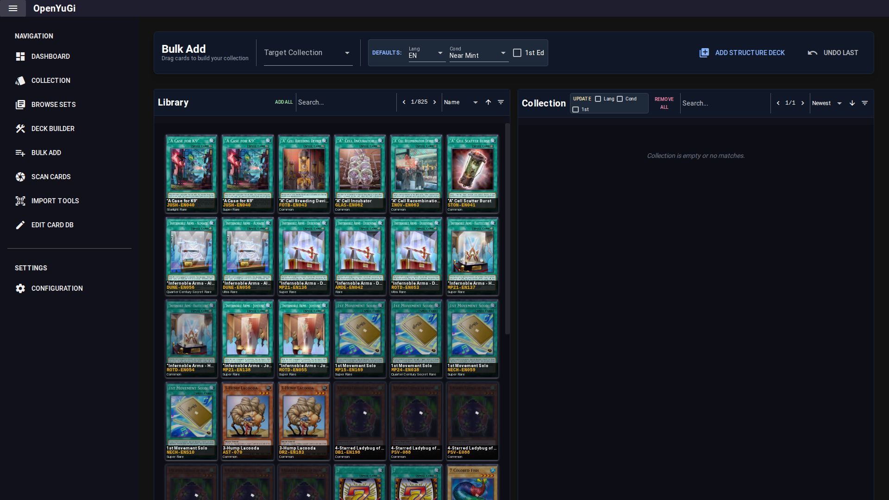

# Bulk Add

The Bulk Add tool is designed for rapid data entry, ideal for cataloging large collections or binders.

## 1. Interface Layout
The screen is split into two halves:
- **Left (Library)**: The full card database.
- **Right (Collection)**: The contents of your selected collection.

## 2. Workflow
1. **Select Collection**: Choose the target collection on the right.
2. **Set Defaults**: In the header, configure the default properties for new cards:
   - **Language**: e.g., English (EN).
   - **Condition**: e.g., Near Mint.
   - **1st Edition**: Check if cards are 1st Ed.
3. **Find Cards**: Search for a card in the Left Pane.
4. **Add**:
   - **Right-Click**: Right-click a card in the Library to add 1 copy with default settings.
   - **Drag & Drop**: Drag a card from Left to Right to add it.
   - **"Add All"**: Adds all currently filtered cards from the Library to the Collection.

## 3. Editing in Bulk
- **Update**: Select cards in the Right Pane (using filters), check the properties you want to change (Lang, Cond, 1st) in the header, and click **Update**. This applies the new default settings to all visible collection entries.
- **Remove**: Right-click a card in the Right Pane to remove it, or drag it back to the Left Pane.

## 4. Structure Decks
Click **Add Structure Deck** to bulk-import a pre-defined list of cards (e.g., "Structure Deck: Yugi"). This is a quick way to add sealed product contents.
