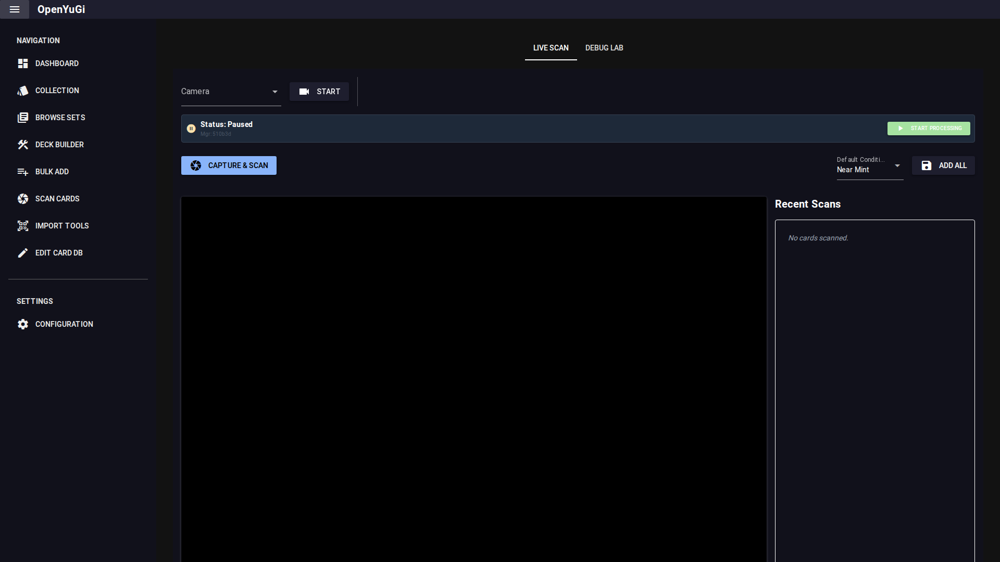

# Card Scanning

The **Scan Cards** tab uses AI (OCR and Object Detection) to identify cards via your webcam.

## 1. Setup & Best Practices
For optimal results, follow these guidelines:
- **Lighting**: Ensure bright, even lighting. Avoid glare on the card surface (sleeves often cause glare).
- **Background**: Use a **clean white background** (e.g., a piece of printer paper). The scanner works best when the card contour is clearly visible against white.
- **Preprocessing**: In the **Debug Lab**, select `classic_white_bg` for the preprocessing mode if using a white background.
- **OCR Track**: `DocTR` (Track 2) is generally more accurate than EasyOCR.

## 2. Live Scan Tab
- **Camera**: Select your webcam.
- **Start/Stop**: Control the camera feed.
- **Capture & Scan**: Click this button to capture the current frame and process it.
- **Auto-Add**: When a card is identified, it appears in the "Recent Scans" list.
- **Ambiguity**: If the scanner finds a card (e.g., "Blue-Eyes") but cannot determine the exact set (LOB vs SDK), an **Ambiguity Dialog** will pop up asking you to select the correct version.

### ⚠️ Important Warnings
- **Multiple Tabs**: Do **NOT** open the Scan page in multiple browser tabs. The ambiguity popup may be sent to the wrong tab, causing the interface to hang or misbehave.
- **Low Res Images**: Before using the "Art Style Match" feature (YOLO), ensure you have downloaded all low-resolution images from the **Settings** menu. The matcher needs these local files to function.

## 3. Debug Lab
The Debug Lab offers advanced controls and visualization.
- **Settings**: Changes made here (Rotation, Thresholds, Tracks) apply to the Live Scan view as well.
- **Visualization**: See exactly what the AI sees—the cropped card, the OCR text detected, and the match candidates.
- **Manual Upload**: You can upload a static image file to test the scanner without a webcam.

