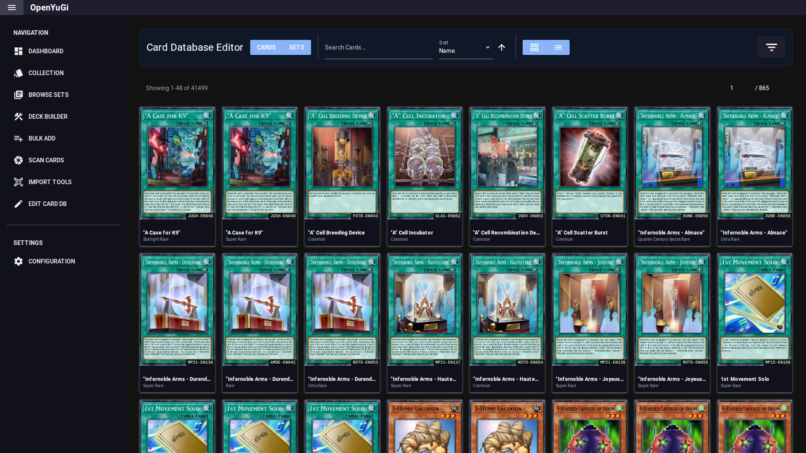

# Database Editor

The Database Editor allows you to modify the local card database. This is useful for fixing missing sets, adding custom cards, or correcting data errors.

## 1. Navigation
- **Cards View**: Search and edit individual cards.
- **Sets View**: Browse sets to perform bulk operations on them.

## 2. Editing a Card
Click on a card to open the **Edit Variant** dialog.
- **Variants**: You can see all known printings of a card.
- **Add Variant**: Create a new printing (e.g., if a new set released and the auto-update hasn't caught it yet).
- **Edit**: Change the Set Code, Rarity, or Image ID of an existing variant.
- **Delete**: Remove a variant.

## 3. Set Operations
In the **Set Detail** view (accessed via Sets View):
- **Bulk Prefix Update**: Change the set code prefix for all cards in a set (e.g., rename `LOB-E` to `LOB-EN`).
- **Add Rarity**: Add a specific rarity variant to *every* card in the set (e.g., adding "Mosaic Rare" to a Battle Pack).
- **Delete Set**: Remove the entire set and all its variants from the database.
