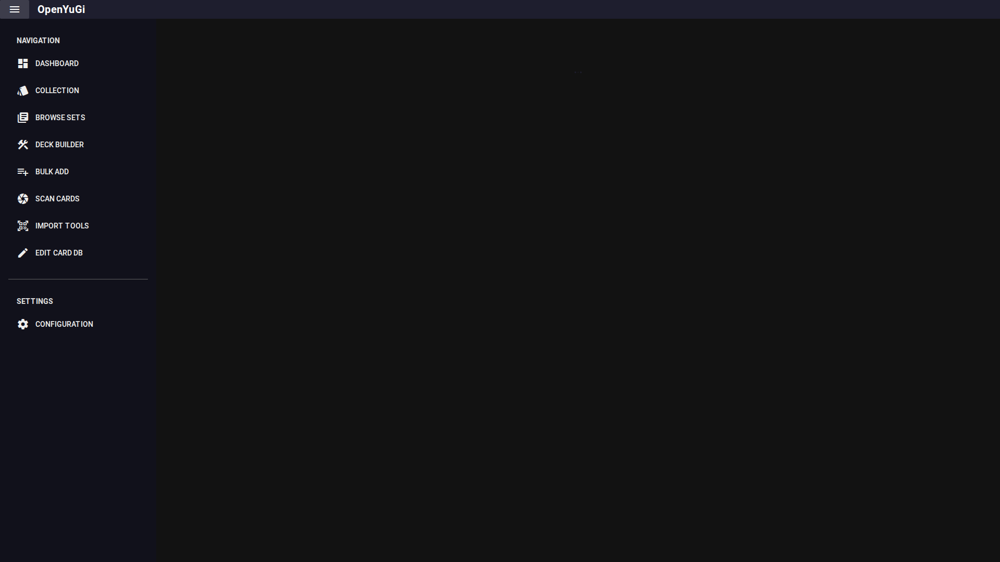
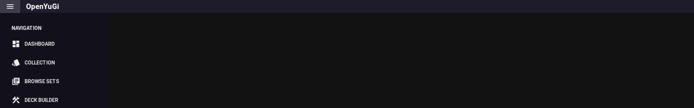
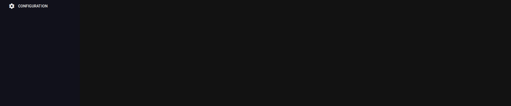

# Dashboard

The Dashboard is the landing page of OpenYuGi. It provides a high-level overview of your collection and quick access to all major features.

## 1. Header & Collection Selection
At the top right of the dashboard, you will find the **Collection Selector**.
- **Selected Collection**: Use the dropdown to switch between different collection files (e.g., `my_collection.json`, `trade_binder.json`). All metrics and charts on the dashboard will update to reflect the selected collection.
- **GitHub Repo**: A link to the project repository.

## 2. Collection Metrics
This section displays key statistics for the currently selected collection:
- **Unique Cards**: The number of distinct card titles you own.
- **Total Quantity**: The total number of physical cards (sum of all quantities).
- **Completion**: The percentage of the total known card database that you own at least one copy of.

## 3. Quick Navigation
The center area provides large cards for navigating to the main tools:
- **Collection**: Go to the detailed inventory view.
- **Deck Builder**: Open the deck construction tool.
- **Browse Sets**: View cards organized by expansion sets.
- **Bulk Add**: Open the mass-entry tool.
- **Scan Cards**: Launch the webcam scanner.
- **Import Tools**: Access import/export and merge functions.
- **Edit Card DB**: Open the database editor.
- **Documentation**: (This Wiki) View help and guides.

## 4. Analytics
At the bottom, you will find visual breakdowns of your collection:
- **Rarity Distribution**: A pie chart showing the spread of rarities in your collection (e.g., Common, Ultra Rare).
- **Condition Distribution**: A pie chart showing the condition of your cards (e.g., Near Mint, Played).

