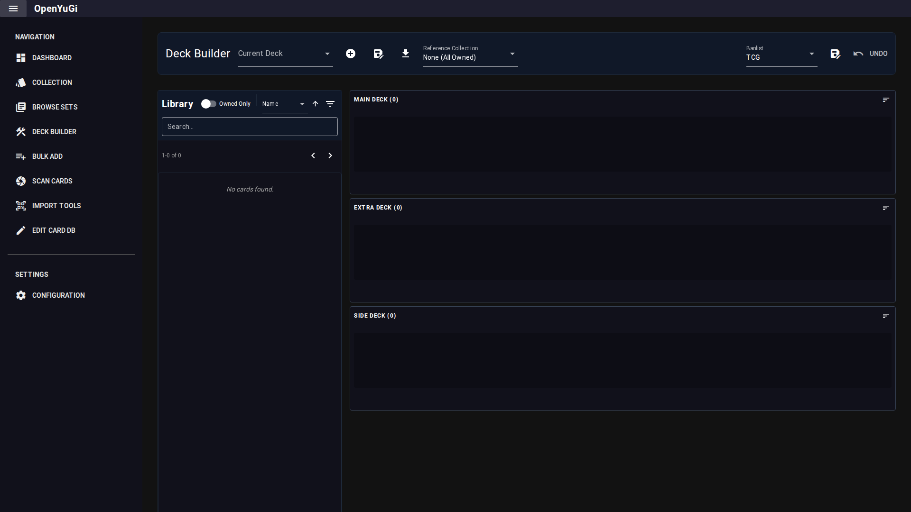

# Deck Builder

The Deck Builder allows you to construct decks using cards from the database or your own collection.

## 1. Deck Management
- **Current Deck**: Select an existing deck to edit or choose `+ New Deck` to create a fresh one.
- **Save**: Save your changes.
- **Save As**: Duplicate the current deck with a new name.
- **Export**: Download the deck in various formats:
    - **.ydk**: Standard format for simulators like EDOPro/YGOOmega.
    - **CSV/JSON**: Data export.
    - **Cardmarket**: Generate a "Wants List" text block for bulk buying.

## 2. Library (Left Pane)
The left column displays the card database.
- **Search**: Filter cards by name or text.
- **Filters**: Use the Filter button to narrow down by Type, Attribute, etc.
- **Owned Only**: Toggle this switch to show only cards currently in your `Reference Collection`.
- **Reference Collection**: Select which collection file to check for ownership. Cards you own will show a quantity badge (e.g., `3`).

## 3. Building Area (Right Pane)
The right area is divided into three zones:
- **Main Deck**: (40-60 cards)
- **Extra Deck**: (0-15 cards)
- **Side Deck**: (0-15 cards)

### Actions
- **Add Card**: Click a card in the Library to add it to the Main Deck (or Extra Deck if appropriate).
- **Remove Card**: Right-click a card in the deck area to remove it.
- **Drag & Drop**: You can drag cards between zones or reorder them within a zone.
- **Move to Side**: Drag a card from Main/Extra to Side.

## 4. Validation & Statistics
- **Banlist**: Select a Banlist (e.g., "TCG") from the header dropdown. Banned/Limited cards will show an icon overlay.
- **Counts**: The header of each zone shows the current card count. It turns red if the count is invalid (e.g., <40 Main Deck).

