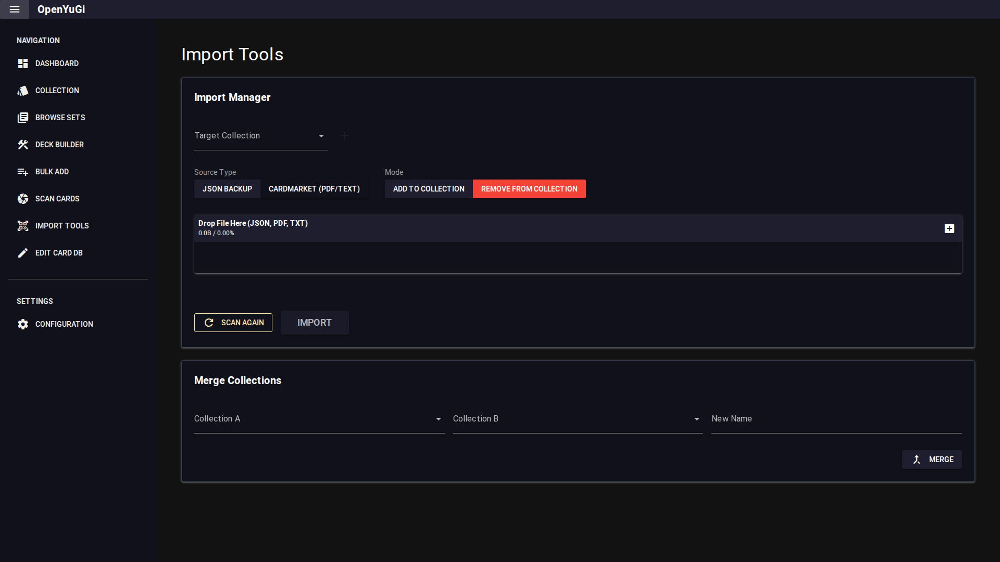

# Import Tools

Import Tools allow you to bring external data into OpenYuGi.

## 1. Import Manager
Supports importing from:
- **JSON Backup**: Restore a collection file previously exported from OpenYuGi.
- **Cardmarket**: Import a list of cards from a Cardmarket export (PDF or Text).

### Modes
- **Add to Collection**: Increases quantities of existing cards or adds new ones.
- **Subtract from Collection**: Decreases quantities (useful for removing a sold list).

### Procedure
1. Select the **Target Collection**.
2. Choose **Source Type** and **Mode**.
3. Upload the file.
4. **Review**: The system will parse the file and show a summary:
   - **Ready to Import**: Clean matches.
   - **Ambiguous**: Cards needing manual resolution (e.g., matching names but unknown sets).
   - **Failures**: Rows that could not be understood.
5. Click **Import** to finalize.

## 2. Merge Collections
Combine two collections into a new file.
- Select **Collection A** and **Collection B**.
- Enter a **New Name**.
- Click **Merge**. The new collection will contain the sum of quantities from both sources.
